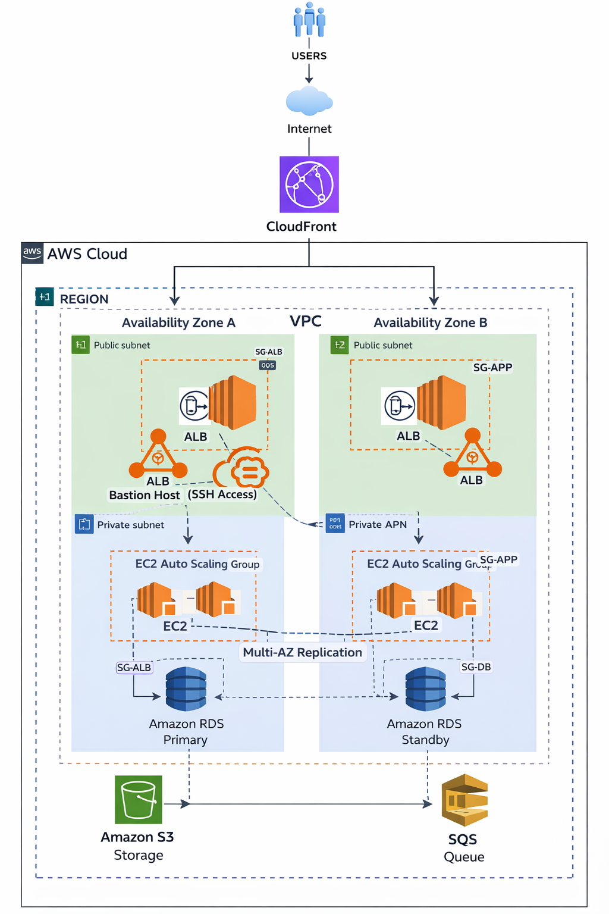

# ☁️ Proyecto – Arquitecturas Cloud Básicas

> Diseño de infraestructura cloud moderna sobre **AWS**, aplicando buenas prácticas de escalabilidad, disponibilidad, resiliencia y eficiencia de costos.

---

## 📐 Arquitectura Final

## 🛠️ Stack Tecnológico

| Categoría | Servicio AWS |
|-----------|-------------|
| Cómputo | EC2, Auto Scaling Group |
| Red | Application Load Balancer, VPC, VPN Site-to-Site |
| Almacenamiento | S3, S3 Glacier |
| Base de datos | RDS (Multi-AZ) |
| CDN | CloudFront |
| Seguridad | WAF, Security Groups, IAM |
| Mensajería | SQS |
| Monitoreo | CloudWatch, Cost Explorer |

---

## ✅ Principios de Diseño Aplicados

- **Escalabilidad** — Auto Scaling horizontal automático
- **Alta disponibilidad** — Distribución Multi-AZ en todas las capas
- **Resiliencia** — Failover automático y procesamiento asíncrono
- **Seguridad** — WAF, HTTPS, acceso restringido a recursos
- **Eficiencia de costos** — Pago por uso, Savings Plans, ciclo de vida de datos
- **Desacoplamiento** — Arquitectura orientada a mensajes con SQS

---

*Proyecto desarrollado como parte del módulo de Arquitecturas Cloud Básicas.*